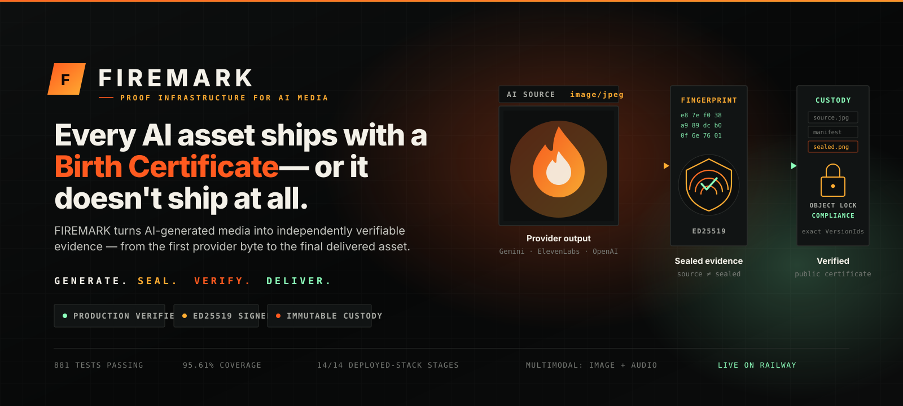
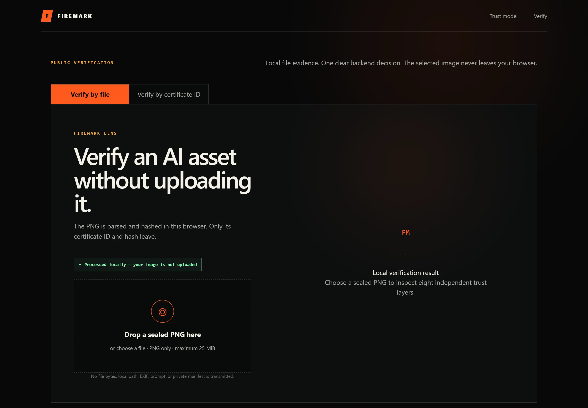
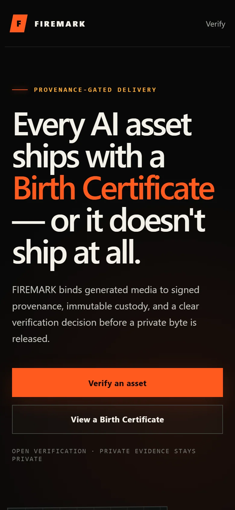

<div align="center">



<br>

**Generate. Seal. Verify. Deliver.**

FIREMARK turns AI-generated media into independently verifiable evidence —
from the first provider byte to the final delivered asset.

<br>

[](https://firemark-web.vercel.app)
[](https://firemark-api-production.up.railway.app/healthz)
[](#quality)
[](#quality)
[](LICENSE)

<br>

**[Launch FIREMARK](https://firemark-web.vercel.app)** ·
**[Verify a certificate](https://firemark-web.vercel.app/verify)** ·
**[See a real Birth Certificate](https://firemark-web.vercel.app/certificate/firemark-cert-977dce1a6b5b7add352854900ddac911)** ·
**[Architecture](docs/architecture.md)** ·
**[Trust model](docs/trust-model.md)** ·
**[60-second demo](docs/demo.md)**

</div>

---

<div align="center">

`PRODUCTION VERIFIED` &nbsp;·&nbsp; `MULTIMODAL: IMAGE + AUDIO` &nbsp;·&nbsp; `881 TESTS PASSING` &nbsp;·&nbsp; `95.61% COVERAGE`
<br>
`ED25519 SIGNED` &nbsp;·&nbsp; `IMMUTABLE B2 CUSTODY` &nbsp;·&nbsp; `ZERO-UPLOAD VERIFICATION` &nbsp;·&nbsp; `14/14 DEPLOYED-STACK STAGES`

</div>

---

## Contents

[The problem](#the-problem) ·
[How FIREMARK works](#how-firemark-works) ·
[See it running](#see-it-running) ·
[Why this is different](#why-this-is-different) ·
[Architecture](#architecture) ·
[Trust contracts](#media-aware-trust-contracts) ·
[Backblaze B2](#backblaze-b2--the-chain-of-custody) ·
[Genblaze](#genblaze--canonical-private-provenance) ·
[Security](#security-and-trust-model) ·
[Who needs this](#who-needs-this) ·
[Production evidence](#production-evidence) ·
[Quickstart](#developer-quickstart) ·
[Business model](#business-model) ·
[Defensibility](#defensibility) ·
[Roadmap](#roadmap) ·
[Quality](#quality)

---

## The problem

AI media is trivial to create and nearly impossible to prove.

A screenshot, a watermark or a database row does not independently establish:

- **which provider** actually produced an asset;
- **which bytes** were originally generated;
- **whether those bytes changed** between generation and delivery;
- **who sealed** the evidence, and with what key;
- **whether the custody record itself** was quietly rewritten;
- **whether the file you received** is the file the certificate describes.

Watermarks degrade under compression. Metadata is strippable. A registry you have to trust is
just a database — and a database can be edited by whoever owns it.

> The gap is not detection. The gap is **evidence**.

---

## How FIREMARK works

Four stages, each producing evidence the next stage commits to.

| | Stage | What is produced |
| :--: | --- | --- |
| **1** | **Generate** | One provider request. The untouched output bytes are hashed as `source_sha256` before anything touches them. |
| **2** | **Seal** | Genblaze builds a canonical private manifest → `canonical_hash`. The distributable carrier is produced and hashed as `sealed_sha256`. An Ed25519 `SealEnvelopeV1` signs the whole binding. |
| **3** | **Preserve** | Source bytes and the full manifest are written to a Backblaze B2 vault under **Object Lock COMPLIANCE** retention. Custody is claimed only after retention is read *back* from B2 and the exact bytes re-downloaded by `VersionId`. |
| **4** | **Verify & deliver** | Anyone can read the public certificate. Delivery is blocked until signature, envelope, custody references and the presented `sealed_sha256` all pass. |

Nothing is returned as "sealed" until custody and registration are verified. If any link
disagrees, verification **fails closed** — it never degrades into trust.

---

## See it running

Real screenshots from the deployed production site. Not mockups.

<div align="center">


*The product states its own contract: evidence before delivery.*

<br>


*A real public Birth Certificate. The sealed SHA-256 `27996070…89dc009e` and canonical hash `b6649ec6…0616a907` shown here match the safe multimodal report byte for byte — [verify it yourself](https://firemark-web.vercel.app/certificate/firemark-cert-977dce1a6b5b7add352854900ddac911).*

<br>

<table>
<tr>
<td width="50%" valign="top">

<p align="center"><em>Verify Gate — the decision that stands between an asset and its delivery.</em></p>
</td>
<td width="50%" valign="top" align="center">

<p align="center"><em>Responsive at 390&nbsp;×&nbsp;844.</em></p>
</td>
</tr>
</table>

</div>

Every capture is reproducible: [`npm run capture:readme`](web/scripts/capture-readme-screenshots.mjs),
with hashes and HTTP statuses recorded in [`manifest.json`](docs/assets/screenshots/manifest.json).

---

## Why this is different

FIREMARK does not try to recognise AI media. It proves **exactly which bytes** were generated,
sealed and delivered.

| | Typical watermark | Metadata-only registry | **FIREMARK** |
| --- | :--: | :--: | :--: |
| Survives distrust of the issuing database | ✗ | ✗ | **✓** signature + immutable custody |
| Verifies exact bytes | ✗ perceptual | ✗ references only | **✓** SHA-256 over real bytes |
| Separates provider source from distributed artifact | ✗ | ✗ | **✓** dual-hash model |
| Storage that cannot be silently rewritten | — | — | **✓** Object Lock COMPLIANCE |
| Verification without uploading the file | ✗ | ✗ | **✓** FIREMARK Lens, in-browser |
| Public certificate for third parties | — | ✓ | **✓** redacted public projection |
| Delivery gated on verification | ✗ | ✗ | **✓** Verify Gate |
| Media-aware contracts (image *and* audio) | — | — | **✓** distinct, honest per medium |

The differentiator is the **complete lifecycle**. Sealing bytes is easy. Proving that the bytes
you received are the bytes that were sealed — while the evidence itself sits somewhere nobody
can rewrite — is the hard part.

---

## Architecture

<div align="center">

</div>

| Layer | Responsibility |
| --- | --- |
| **Experience** | Next.js App Router on Vercel. Server components for public pages, one client component for Verify Gate, one server-only route handler for delivery. |
| **Control plane** | FastAPI on Railway. Five endpoints, zero-network construction, every external client lazy and injectable. |
| **Generation** | Google Gemini (Nano Banana 2), ElevenLabs, OpenAI. Bounded, non-redirecting HTTPS adapters with normalized safe failure codes. |
| **Evidence & sealing** | SHA-256 source digest → Genblaze canonical manifest → deterministic PNG carrier + public capsule → Ed25519 `SealEnvelopeV1`. |
| **Custody** | Two separately credentialed private Backblaze B2 buckets; the vault under Object Lock COMPLIANCE. |
| **Control-plane DB** | Supabase: six RLS tables, a service-role-only atomic registration RPC, a safe allowlisted public projection RPC. |
| **Public verification** | Public certificate, Verify Gate, authorized delivery, Proof Packs. |
| **Local verification** | FIREMARK Lens — PNG chunk parsing and Web Crypto hashing entirely in the browser. |

Full component detail, sequence diagrams and trust boundaries: **[docs/architecture.md](docs/architecture.md)**.

---

## Media-aware trust contracts

Most provenance tools pretend every medium behaves the same. They do not, and saying otherwise
is a security claim you cannot keep.

<div align="center">

</div>

**Images** — the FIREMARK public capsule is embedded into a deterministic PNG `tEXt` chunk, so the
distributed container is *not* the provider's bytes. `source_sha256 ≠ sealed_sha256`, and that
difference is enforced: a run where they matched would be rejected as `SEALED_HASH_UNCHANGED`.
A sealed PNG carries its own proof and can be verified from the file alone.

**Audio** — MP3 sealing is explicitly **byte-preserving**. No fake capsule is injected, so
`source_sha256 == sealed_sha256` by design. Verification uses the public `cert_id` plus a locally
computed SHA-256, and FIREMARK Lens marks the embedded-capsule layer `NOT CHECKED` rather than
implying a proof it does not have.

The capsule also deliberately **excludes** `sealed_sha256` — embedding a hash of the file into
the file would create a circular dependency. It carries `source_sha256`, `canonical_hash`, the
identifiers, the signer key ID and the verification URL. Nothing else.

---

## Backblaze B2 — the chain of custody

B2 is not "where the files go." It is the reason a FIREMARK certificate means anything after the
fact.

<div align="center">

</div>

FIREMARK runs **two separately credentialed private buckets** with different capabilities:

- The **assets bucket** holds operational copies and the sealed distributable. Its key can delete.
- The **vault bucket** holds the provider source and the full canonical manifest under **Object
  Lock COMPLIANCE** retention. Its key cannot bypass governance. Vault objects never enter any
  cleanup path.

Three properties make this custody rather than storage:

1. **Retention is proved, not assumed.** Object Lock being *enabled* on a bucket only means the
   bucket accepts retention parameters. FIREMARK claims custody only after it reads both object
   retentions back from B2, confirms `COMPLIANCE` mode, confirms a sufficient retain-until date,
   and re-downloads the exact bytes. COMPLIANCE retention cannot be shortened or bypassed by
   FIREMARK itself.
2. **Exact `VersionId`s are the evidence.** Every head, download and retention request carries the
   exact version. Those versions are bound into the signed envelope, so a certificate points at a
   specific immutable object generation — not at a mutable key.
3. **Read-after-write is verified.** Uploads are re-downloaded and hash-checked under a bounded
   shared retry budget. Only transient conditions retry; permission, credential, bucket, lock-mode,
   expired-retention, wrong-version, malformed and hash failures fail immediately.

Remove B2 and the trust model collapses to "trust our database." That is precisely the failure
mode FIREMARK exists to eliminate.

Implementation: [`api/firemark/b2_storage.py`](api/firemark/b2_storage.py),
[`api/firemark/custody.py`](api/firemark/custody.py).

---

## Genblaze — canonical private provenance

Genblaze produces the **canonical private record** of how an asset came to exist, and reduces it
to one hash the public certificate can commit to without leaking anything.

For each sealed asset FIREMARK builds a real Genblaze `Run` and `Manifest` containing the private
prompt or TTS text, provider parameters, seed, modality, provider identity, the normalization step
and the asset digest. `Manifest.verify()` must pass, and the resulting `canonical_hash` is bound
into the Ed25519 envelope and published on the certificate.

That single hash is the whole point of the split:

- The **complete manifest stays private**, retained in the immutable B2 vault.
- The **`canonical_hash` is public**, so anyone can confirm the certificate commits to *one*
  specific provenance record.
- Nobody can reconstruct the prompt from the hash, and nobody can swap the provenance without
  breaking the signature.

FIREMARK pins the authorized matrix exactly — `genblaze-core==0.3.8`, `genblaze-cli==0.3.6`,
`genblaze-s3==0.3.6` — with public-protocol contract tests, and never imports underscore-prefixed
Genblaze internals. Where the installed version cannot provide what custody requires (retention
inspection, exact `VersionId` proof, corroborated delete denial, preflight-free presigning),
FIREMARK implements those controls directly and documents why:
[docs/upstream/genblaze-s3-compatibility-feedback.md](docs/upstream/genblaze-s3-compatibility-feedback.md).

Implementation: [`api/firemark/genblaze_provenance.py`](api/firemark/genblaze_provenance.py).

---

## Security and trust model

<div align="center">

</div>

### What FIREMARK proves

- The delivered bytes hash to the `sealed_sha256` in a signed certificate.
- The certificate's envelope was signed by the holder of a specific Ed25519 private key, and binds
  to the expected public-key fingerprint and `signer_key_id`.
- The envelope commits to one canonical provenance record via `canonical_hash`.
- The referenced source and manifest exist in immutable custody at exact `VersionId`s under active
  COMPLIANCE retention.
- The certificate has not been revoked at verification time.

### What FIREMARK does not claim

- **Not** that a provider's own provenance claims are true.
- **Not** that the named signer was authorized to sign — that requires identity and operational
  controls outside this milestone.
- **Not** that generation occurred as described; it proves the evidence chain, not the world.
- **Not** that an image is "real," "safe" or "true." FIREMARK is **tamper-evident**, not
  tamper-proof.
- **Not** that all media carries embedded proof — that is true for sealed PNG only.

### Controls in the critical path

Prompts, TTS text, API keys, bearer credentials, signing private keys, service-role keys, B2
application keys, private manifests, raw provider responses and presigned URLs never appear in a
public certificate, a log, a report, a checkpoint or an exception. Delivery URLs exist only in the
successful HTTP serializer. Provider failures are normalized into safe codes carrying, at most, a
status, an allowlisted reason token, an allowlisted exception class name and allowlisted structured
field paths. Ordinary tests are **zero-network**.

Full threat model: **[docs/trust-model.md](docs/trust-model.md)**.

---

## Who needs this

| Who | The pain | The outcome |
| --- | --- | --- |
| **Creators & agencies** | "Prove this deliverable is the file you approved." | A public certificate travels with the work. |
| **Media & newsrooms** | AI disclosure that survives republication. | Byte-level provenance on the record. |
| **Education & research** | Attributing generated material honestly. | Verifiable origin without exposing prompts. |
| **Marketplaces** | Listings backed by unverifiable claims. | Gate publication on a passing Verify Gate. |
| **Enterprise content ops** | "What shipped, when, from which model?" | An auditable trail with immutable custody. |
| **AI platforms & model providers** | Provenance bolted on after the fact. | Issue certificates at generation time via API. |
| **Legal & audit** | Screenshots are not evidence. | Signed records against retained originals. |

---

## Production evidence

Every row below is backed by a safe report committed in this repository or by a tagged checkpoint.

**Deployed-stack smoke — 14/14 stages PASS** *(read-only, reused an existing certificate; `new_provider_calls: 0`)*

| Stage | Result | Stage | Result |
| --- | :--: | --- | :--: |
| Configuration validation | ✅ | Public certificate API | ✅ |
| Backend health | ✅ | Public verify API | ✅ |
| Frontend landing | ✅ | Frontend delivery route | ✅ |
| Frontend verify page | ✅ | Delivered asset download | ✅ |
| Frontend certificate page | ✅ | Delivered SHA-256 verification | ✅ |
| Response header security | ✅ | Embedded capsule verification | ✅ |
| Secret leak scan | ✅ | Safe report | ✅ |

**Multimodal lifecycle — both operations complete**

| | Google Gemini · Nano Banana 2 | ElevenLabs |
| --- | --- | --- |
| Certificate | `firemark-cert-977dce1a6b5b7add352854900ddac911` | `firemark-cert-e0c6fbf7bfc482f765c636963cfcbbbf` |
| Media | `image` · sealed `image/png` · source `image/jpeg` | `audio` · `audio/mpeg` |
| Hash contract | `source ≠ sealed` ✅ | `source = sealed` ✅ |
| Stages | 17/17 PASS | 16/16 PASS |
| Provider calls | 1 (recorded) | 1 (recorded) |
| B2 custody · Supabase | ✅ · ✅ | ✅ · ✅ |

<details>
<summary><strong>Reproducibility</strong></summary>

<br>

| Item | Value |
| --- | --- |
| Verified commit | `266e429a938cb47d65ff5b5addf80f8bed90b1e7` |
| Production checkpoint tag | `checkpoint-production-multimodal-stack` |
| Multimodal checkpoint tag | `checkpoint-multimodal-generation-live` |
| Deployed-stack report SHA-256 | `776e2c21ce7ca2d1125fde06a82ae0ae2b78ccf3d1850e4d4831465ecc9d609d` |
| Safe reports | [`deployed-stack-report.json`](.artifacts/deployed-stack-report.json) · [`multimodal-generate-and-seal-report.json`](.artifacts/multimodal-generate-and-seal-report.json) |

Both reports exclude prompts, TTS text, credentials, headers, private manifests, provider responses
and transient URLs by construction — the report writer refuses to serialize a payload containing
forbidden markers.

</details>

---

## 60-second demo

1. **Open** [firemark-web.vercel.app](https://firemark-web.vercel.app) — the product states its own contract.
2. **Inspect** the [Gemini Birth Certificate](https://firemark-web.vercel.app/certificate/firemark-cert-977dce1a6b5b7add352854900ddac911) — certificate ID, both hashes, canonical hash, signer key ID, status.
3. **Compare** it with the [ElevenLabs certificate](https://firemark-web.vercel.app/certificate/firemark-cert-e0c6fbf7bfc482f765c636963cfcbbbf) — same structure, different hash contract.
4. **Verify** at [/verify](https://firemark-web.vercel.app/verify) — drop a sealed PNG and watch the layers resolve locally.
5. **Tamper** — flip one byte and watch delivery get blocked.
6. **Download a Proof Pack** — public certificate, Ed25519 public key, offline QR, instructions. No media, no bearer, no presigned URL.

Full script with fallbacks: **[docs/demo.md](docs/demo.md)**.

---

## Developer quickstart

**Requirements:** Python 3.12, Node 20.9+.

```powershell
git clone https://github.com/jpablortiz96/firemark.git
cd firemark
python -m venv .venv
.\.venv\Scripts\Activate.ps1
python -m pip install -e ".[dev]"
Copy-Item .env.example .env      # variable names only — never commit real values
python -m pytest
```

Run the backend with the in-memory repository (no external service, no credentials):

```powershell
python -m uvicorn api.firemark.app:create_app --factory --host 127.0.0.1 --port 8000
```

OpenAPI is served at `http://127.0.0.1:8000/docs`.

Run the frontend:

```powershell
cd web
npm install
npm run dev
```

Configure `web/.env.local` — only the API base is browser-visible:

```text
NEXT_PUBLIC_FIREMARK_API_BASE_URL=http://127.0.0.1:8000
FIREMARK_DELIVERY_API_KEY=          # server-only, never NEXT_PUBLIC_
FIREMARK_PUBLIC_SITE_URL=http://localhost:3000
```

### Public API

```bash
# Read a public Birth Certificate — no authentication
curl https://firemark-api-production.up.railway.app/v1/certificates/<CERT_ID>

# Verify a file you hold locally
curl -X POST https://firemark-api-production.up.railway.app/v1/verify \
  -H 'Content-Type: application/json' \
  -d '{"cert_id":"<CERT_ID>","presented_sha256":"<SHA256_OF_YOUR_FILE>"}'
```

Sealing is admin-authenticated and idempotent:

```bash
curl -X POST https://firemark-api-production.up.railway.app/v1/generate-and-seal \
  -H 'Authorization: Bearer <FIREMARK_ADMIN_API_KEY>' \
  -H 'Idempotency-Key: <SAFE_UNIQUE_KEY>' \
  -H 'Content-Type: application/json' \
  -d '{"media_type":"image","provider":"google_gemini","prompt":"<PROMPT>"}'
```

Deeper material: **[deployment runbook](docs/deployment.md)** ·
**[frontend architecture](docs/frontend-architecture.md)** ·
**[trust model](docs/trust-model.md)**.

<details>
<summary><strong>Quality gates and safe local checkpoints</strong></summary>

<br>

```powershell
python -m pytest
python -m pytest --cov=api.firemark --cov-report=term-missing --cov-fail-under=95
python -m ruff check .
python -m mypy api scripts
cd web; npm test; npm run lint; npm run typecheck; npm run build
```

Zero-network local proofs (no provider, no cost):

```powershell
python scripts\smoke_trust.py               # local Ed25519 behaviour
python scripts\smoke_genblaze_roundtrip.py  # Genblaze contract roundtrip
python scripts\diagnose_gemini_access.py    # read-only provider diagnostics
```

Every live checkpoint is gated behind an explicit `--live`. Without it, no client is constructed
and the command exits with informational code **2**. Live commands persist atomic state before
submission and immediately after valid bytes, so an interrupted run resumes from persisted
evidence instead of re-billing a provider. An ambiguous outcome fails closed and requires explicit
operator authorization to start a new operation — it is never silently retried.

</details>

---

## Business model

FIREMARK is built as infrastructure, and infrastructure monetizes on volume and retention. None of
the following is implemented billing today; it is the commercial shape the architecture already
supports.

| Layer | Model |
| --- | --- |
| **Public verification** | Free, forever. Trust networks need an unpriced verification path. |
| **Developer API** | Per sealed certificate. The unit of value is one asset entering the evidence chain. |
| **Teams** | Asset history, workspaces, revocation controls, shared audit views. |
| **Enterprise** | Extended retention windows, private deployment, custody policy, audit export, SSO. |
| **Custody tiers** | Retention duration and volume — the immutable vault is a recurring, sticky cost centre. |
| **SDKs & white-label** | Embedded verification in someone else's product surface. |
| **Platform integrations** | Model providers and marketplaces issuing certificates at generation time. |

The strategic wedge is the last row: whoever verifies at the moment of generation owns the
provenance layer for everything downstream.

---

## Defensibility

Wrapping an AI provider is a weekend. This is not that.

- **Custody architecture.** Immutable retention proved by read-back, exact `VersionId` binding and
  corroborated delete denial — not an upload call.
- **Dual-hash evidence model.** Source and sealed digests with separate, enforced roles.
- **Signed canonical provenance.** A private manifest reduced to one public hash inside a signed
  envelope.
- **Media-aware contracts.** Honest, distinct verification per medium — and the discipline to say
  `NOT CHECKED` where a proof does not exist.
- **Recovery-safe generation.** Atomic checkpoints, exactly-once provider calls, fail-closed
  ambiguity handling. Expensive to retrofit, invisible until it saves you.
- **Public/private evidence separation** enforced at the database boundary by RLS and an
  allowlisted projection RPC, not by application convention.
- **Integrations in the critical path.** Backblaze B2 and Genblaze are not swappable add-ons; the
  trust model is defined in terms of what they guarantee.

---

## Roadmap

Not shipped. Direction, stated honestly.

- Video sealing and verification contracts
- C2PA interoperability
- Batch sealing and bulk certificate issuance
- Organization workspaces and delegated chain of custody
- Official SDKs (TypeScript, Python)
- Browser extension for inline verification
- Marketplace and model-provider integrations
- Policy automation for retention and revocation

---

## Repository map

```text
api/firemark/            FastAPI backend
  ├─ api/routes/         health · certificates · verify · delivery · generate
  ├─ control_plane/      models, service, Supabase + in-memory repositories
  ├─ generation/         Gemini · ElevenLabs · OpenAI adapters, normalization
  ├─ b2_storage.py       bounded B2 client, exact-version operations
  ├─ custody.py          Object Lock COMPLIANCE custody workflow
  ├─ genblaze_provenance.py   canonical private manifests
  ├─ public_capsule.py   FiremarkPublicCapsuleV1 embed/extract
  ├─ seal_envelope.py    SealEnvelopeV1 + Ed25519 signing
  └─ generate_and_seal.py  end-to-end orchestration
web/                     Next.js App Router frontend
  ├─ src/app/            landing · /verify · /certificate/[certId]
  ├─ src/lib/            typed API client, FIREMARK Lens, Proof Packs
  └─ scripts/            reproducible README screenshot capture
supabase/migrations/     RLS schema + atomic registration RPCs
scripts/                 smokes, diagnostics, recovery-safe checkpoints
tests/                   882 zero-network tests
docs/                    architecture · trust model · demo · deployment
```

---

## Quality

| Gate | Result |
| --- | --- |
| Tests | **881 passed, 1 skipped** |
| Coverage (`api.firemark`) | **95.61%**, gate at 95% |
| Type checking | `mypy --strict` over `api` and `scripts` — clean |
| Linting | `ruff` — clean |
| Frontend | `vitest`, `eslint`, `tsc --noEmit`, `next build` — clean |
| Deployed-stack smoke | **14/14 PASS** |
| Tagged checkpoints | 7, including `checkpoint-production-multimodal-stack` |

Application construction performs **no network request**. Ordinary tests contact no provider, no
database and no object store.

---

## Honest limitations

- B2 custody spans multiple objects and is **not cross-object atomic**. A registration failure can
  leave safe, billable partial storage that must be inspected before cleanup — the repository ships
  read-only inspectors for exactly this.
- The signature does not prove the named signer was *authorized*. Identity and operational controls
  are future work.
- `Manifest.verify()` validates the canonical manifest and declared digest coverage; it does not
  re-hash the post-embedding container. FIREMARK binds the distributed container separately through
  `sealed_sha256`.
- Genblaze 0.3.8 stores redacted pointer payloads as a sidecar rather than inside PNG bytes;
  FIREMARK therefore publishes its own public capsule and resolves pointers through B2 custody.

---

## License & author

[MIT](LICENSE) · Built by **Juan Pablo Enriquez Ortiz** ([@jpablortiz96](https://github.com/jpablortiz96)).

---

<div align="center">

**AI media will scale faster than human trust.**
<br>
**FIREMARK makes the proof scale with it.**

<br>

[Launch FIREMARK](https://firemark-web.vercel.app) ·
[Verify a certificate](https://firemark-web.vercel.app/verify) ·
[Read the architecture](docs/architecture.md)

</div>
