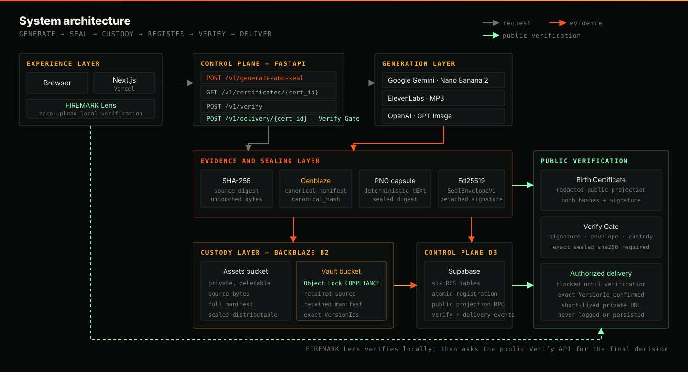
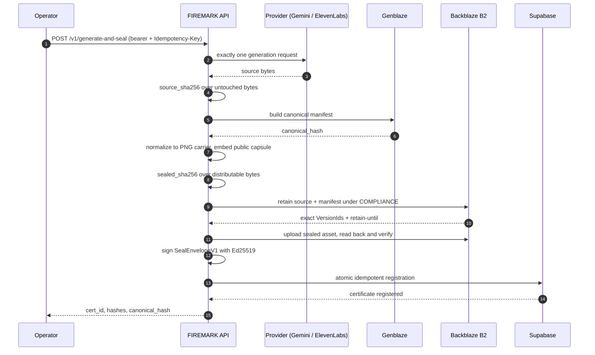
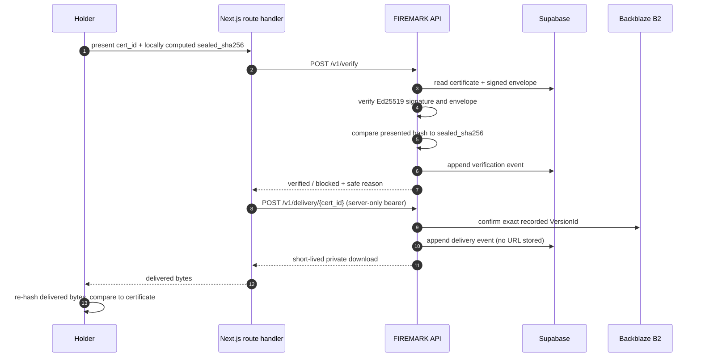
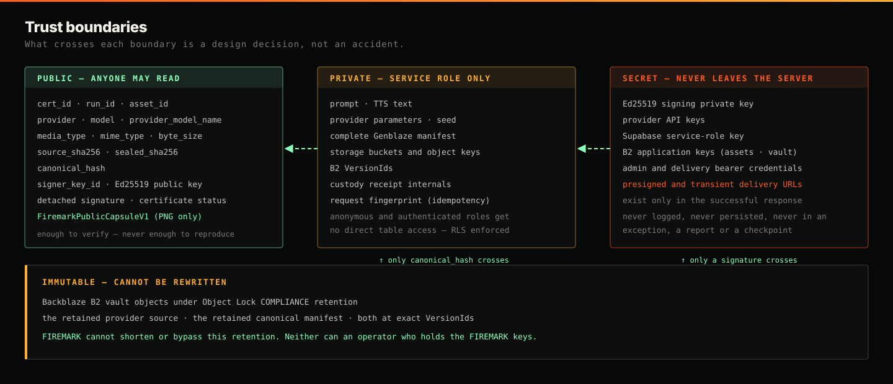
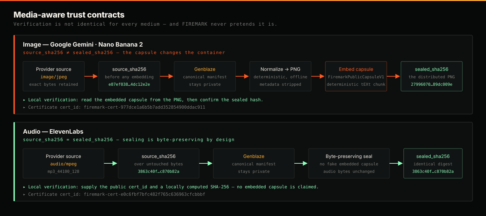
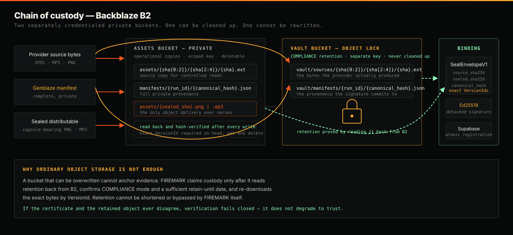
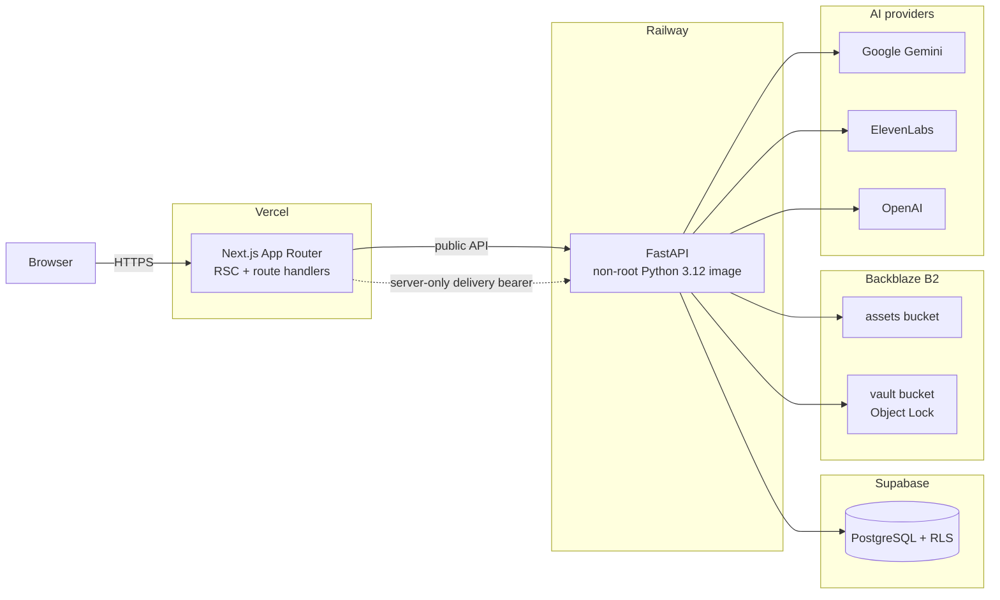

# FIREMARK architecture

How an AI-generated asset becomes independently verifiable evidence, layer by layer.

> New here? Start with the [README](../README.md). This page is the engineering detail behind it.

---

## Contents

[System overview](#system-overview) ·
[Generate & Seal](#generate--seal) ·
[Verify & deliver](#verify--deliver) ·
[Trust boundaries](#trust-boundaries) ·
[Hash contracts](#hash-contracts) ·
[Custody](#custody) ·
[Deployment topology](#deployment-topology) ·
[Data lifecycle](#data-lifecycle) ·
[Component responsibilities](#component-responsibilities)

---

## System overview



Seven layers. The browser never talks to a provider, never holds a bearer credential and never
receives a private manifest. The control plane owns every boundary crossing.

The FastAPI application is built by `api.firemark.app.create_app()`. Construction creates **no
external clients** and accepts injected repository and delivery-storage implementations, so local
and test use can rely on a deterministic in-memory repository. `api.firemark.bootstrap.build_runtime()`
is the explicit production composition root; provider, B2, signing and delivery dependencies are
constructed only when their operation is requested.

The HTTP surface is intentionally small:

| Method | Path | Contract |
| --- | --- | --- |
| `GET` | `/healthz` | Local process health. External dependencies are not contacted. |
| `GET` | `/v1/certificates/{cert_id}` | Redacted public Birth Certificate. |
| `POST` | `/v1/verify` | Signature, envelope, custody-reference, status and optional hash verification. |
| `POST` | `/v1/generate-and-seal` | Admin-authenticated, idempotent image or audio sealing. |
| `POST` | `/v1/delivery/{cert_id}` | Delivery-authenticated Verify Gate requiring the exact `sealed_sha256`. |

Generation and delivery use **distinct** `SecretStr` bearer credentials compared in constant time.
Missing or invalid credentials return 401. Health, certificate and verify routes stay anonymous.

CORS is driven by `FIREMARK_ALLOWED_ORIGINS`, a strict JSON list. HTTPS origins are required except
for explicit `localhost`, `127.0.0.1` or `::1` development origins. Wildcards, credentials in
origins, paths, queries, fragments and credentialed CORS are all rejected.

---

## Generate & Seal



The order is not incidental — each step commits to the previous one:

1. **Generate** one PNG/JPEG through OpenAI or Google Gemini, or one MP3 through ElevenLabs, and
   hash the untouched bytes as `source_sha256`.
2. **Normalize** a non-PNG image source into a deterministic PNG carrier
   ([`generation/normalization.py`](../api/firemark/generation/normalization.py)). A PNG source is
   carried through untouched so existing evidence stays byte identical.
3. **Build and verify** the complete private canonical Genblaze manifest and obtain its
   `canonical_hash`.
4. **Seal.** For images, embed `FiremarkPublicCapsuleV1` into a deterministic `tEXt` chunk. For
   MP3, create a closed `FiremarkPublicAudioReferenceV1` without changing or pretending to embed
   audio bytes.
5. **Retain** the raw source and full manifest in the B2 vault under COMPLIANCE retention,
   verifying bytes and exact `VersionId`s.
6. **Upload and re-download** the sealed media at a content-addressed key using allowlisted
   metadata only.
7. **Sign** `SealEnvelopeV1`, then **atomically register** the certificate bundle in Supabase.

No successful API response is returned before verified custody and registration.

### Idempotency and recovery

The idempotency key deterministically names the private run, asset and certificate. A private
request fingerprint stored inside `parameters_private` returns the same completed result for an
identical retry and rejects a conflicting retry with HTTP 409.

Live checkpoints persist atomic safe state before submission, after a definitive provider
rejection, immediately after valid bytes are received, and before and after each irreversible
B2/Supabase stage. Once valid bytes exist locally, recovery **reuses them** and the provider is
never called again. An ambiguous outcome — a timeout, a lost connection after submission, an
uncaptured result — fails closed and requires explicit operator authorization to begin a new
operation. Checkpoints are archived, never discarded.

### Provider adapters

All three adapters are bounded, non-redirecting HTTPS clients that normalize every failure into a
safe code and never leak a raw body into an exception.

**Google Gemini** uses the official Interactions API at `POST /v1beta/interactions`, authenticated
only through `x-goog-api-key`. It sends exactly the fields the model's own documented examples use
— `model`, `input`, `response_format` — and a `FORBIDDEN_REQUEST_FIELDS` guard asserts the generic
schema's extra capabilities are never emitted. The JPEG arrives inline as Base64 and is validated
structurally before it is treated as a result.

**ElevenLabs** requests `mp3_44100_128` and accepts only bounded `audio/mpeg` bytes.

**OpenAI** selects PNG output and consumes the documented base64 or URL response shape through an
HTTPS-only, hostname-allowlisted, bounded, non-redirecting download.

Transport failures are classified individually — a DNS problem, a read timeout, a truncated body
and an HTTP 5xx are never confused. Only a normalized code, an HTTP status, an allowlisted reason
token, an allowlisted exception class name and allowlisted structured field paths are ever
persisted.

---

## Verify & deliver



The Verify Gate **records verification before making a delivery decision**. It asks the injected B2
delivery adapter to confirm the recorded exact `VersionId`, and issues a short-lived private
download only after status, signature, envelope, custody references and the presented
`sealed_sha256` all pass.

The raw URL exists only in the successful HTTP serializer. The domain result, event repository,
logs, exceptions and failure responses contain no URL.

The browser never receives `FIREMARK_DELIVERY_API_KEY`. A server-only Next.js route handler
exchanges that bearer for a short-lived URL **after** FastAPI independently repeats verification.

---

## Trust boundaries



The public certificate includes public identifiers, provider/model, categorical and MIME media
types, byte size, safe dimensions/duration, both asset hashes, `canonical_hash`, signer material,
status, issuance time, verification URL and a redacted media projection.

Prompts, parameters, seeds, storage locations, `VersionId`s and custody receipt internals remain
private. The migration at
[`supabase/migrations/20260729000100_firemark_control_plane.sql`](../supabase/migrations/20260729000100_firemark_control_plane.sql)
creates six RLS tables; anonymous and authenticated roles receive **no direct table access**. A
safe public certificate RPC exposes an allowlist, while a service-role-only PostgreSQL RPC
atomically and idempotently registers the run, asset, custody record and certificate.
`20260730000100_firemark_multimedia.sql` adds public-safe multimedia facts, conditional image hash
constraints and the expanded projections without exposing private evidence.

The public capsule contains only its fixed schema version, certificate/run/asset identifiers,
`canonical_hash`, `source_sha256`, signer key ID, verification URL and issuance time. It **excludes**
`sealed_sha256`, because embedding that value would create a circular hash. Re-embedding an
identical capsule is byte-deterministic; conflicting, duplicate, malformed, oversized and
non-canonical capsules fail closed. PNG pixel data is preserved.

---

## Hash contracts



`source_sha256` and `sealed_sha256` retain distinct roles and must never be treated as
interchangeable labels:

- `source_sha256` identifies the generated provider output before media embedding.
- `sealed_sha256` identifies the final distributed file after the media-specific sealing strategy.

For PNG images those values **must differ** — capsule embedding changes the container, and a run
where they matched is rejected. MP3 audio uses an explicitly byte-preserving sealing strategy, so
both roles intentionally contain the same digest, and audio is verified by `cert_id` plus the
locally calculated hash. FIREMARK does not claim an embedded audio capsule.

The Genblaze asset digest and the FIREMARK container digest cover different bytes: the Genblaze
`Asset.sha256` equals `source_sha256`, while `sealed_sha256` is the digest of the final distributed
file.

---

## Custody



Deterministic key layout:

```text
assets/{sha256[0:2]}/{sha256[2:4]}/{sha256}.{extension}
manifests/{run_id}/{canonical_hash}.json
public/{cert_id}/pointer.json
public/{cert_id}/signed-envelope.json
public/{cert_id}/custody-receipt.json
vault/sources/{sha256[0:2]}/{sha256[2:4]}/{sha256}.{extension}
vault/manifests/{run_id}/{canonical_hash}.json
```

Assets and vault application keys must be **different** and scoped to their respective private
buckets. The vault key must be able to write retained versions, read retention, head and download
objects, and attempt normal deletion *without* a governance-bypass capability. Neither bucket is
ever public.

Exact-version read-after-write verification uses one shared bounded retry budget: at most five
attempts and ten seconds total with short backoff. Only temporary `NoSuchKey`, `NoSuchVersion`,
`NotFound`, absent immediate retention and retryable transport failures are retried. Permission,
credential, bucket, Object Lock mode, expired retention, wrong `VersionId`, malformed response and
hash failures fail immediately. Retention timestamps are normalized to UTC with safe sub-second
service normalization.

FIREMARK uses public `S3StorageBackend` and `ObjectStorageSink` integration for normal Genblaze
pipeline compatibility, and direct boto3 calls for custody controls, because genblaze-s3 0.3.6 does
not expose sufficient retention inspection, exact `VersionId` proof or corroborated delete denial.
FIREMARK also presigns through boto3 because genblaze-s3 `presigned_get()` performs a remote
preflight even when constructed with `preflight=False`.

---

## Deployment topology



The Vercel project root is `web/`; the Railway health check is `/healthz`. The backend image is a
non-root Python 3.12 build. Gemini image generation contacts exactly one outbound host,
`generativelanguage.googleapis.com`, and the API key is presented to no other origin.

Full sequence: [deployment runbook](deployment.md).

---

## Data lifecycle

| Phase | Where it lives | Who can read it |
| --- | --- | --- |
| Prompt / TTS text | Supabase `generation_runs.prompt_private` | Service role only |
| Provider source bytes | B2 assets + B2 vault (COMPLIANCE) | Service role only |
| Canonical manifest | B2 assets + B2 vault (COMPLIANCE) | Service role only |
| `canonical_hash` | Certificate | Public |
| Sealed distributable | B2 assets, content-addressed | Delivered after Verify Gate |
| `source_sha256`, `sealed_sha256` | Certificate + signed envelope | Public |
| Signed envelope + signature | Certificate | Public |
| Exact `VersionId`s | Signed envelope, private records | Service role only |
| Delivery URL | Successful HTTP response only | Transient, never persisted |

---

## Component responsibilities

| Module | Responsibility |
| --- | --- |
| [`app.py`](../api/firemark/app.py) | FastAPI application factory, CORS, zero-network construction |
| [`bootstrap.py`](../api/firemark/bootstrap.py) | Production composition root, lazy client factories |
| [`generate_and_seal.py`](../api/firemark/generate_and_seal.py) | End-to-end orchestration, idempotency, checkpoint callbacks |
| [`generation/`](../api/firemark/generation/) | Provider adapters, source-accurate media models, deterministic normalization |
| [`genblaze_provenance.py`](../api/firemark/genblaze_provenance.py) | Canonical manifest construction and bounded parsing |
| [`public_capsule.py`](../api/firemark/public_capsule.py) | `FiremarkPublicCapsuleV1` embed/extract, audio reference |
| [`seal_envelope.py`](../api/firemark/seal_envelope.py) | `SealEnvelopeV1`, canonical serialization, signing |
| [`signer.py`](../api/firemark/signer.py) | Ed25519 key handling and signer key IDs |
| [`b2_storage.py`](../api/firemark/b2_storage.py) | Bounded B2 client, exact-version operations, presigning |
| [`custody.py`](../api/firemark/custody.py) | COMPLIANCE custody workflow and receipts |
| [`control_plane/`](../api/firemark/control_plane/) | Records, certificate service, Verify Gate, repositories |
| [`web/src/lib/`](../web/src/lib/) | Typed API client, FIREMARK Lens, Proof Pack generation |
