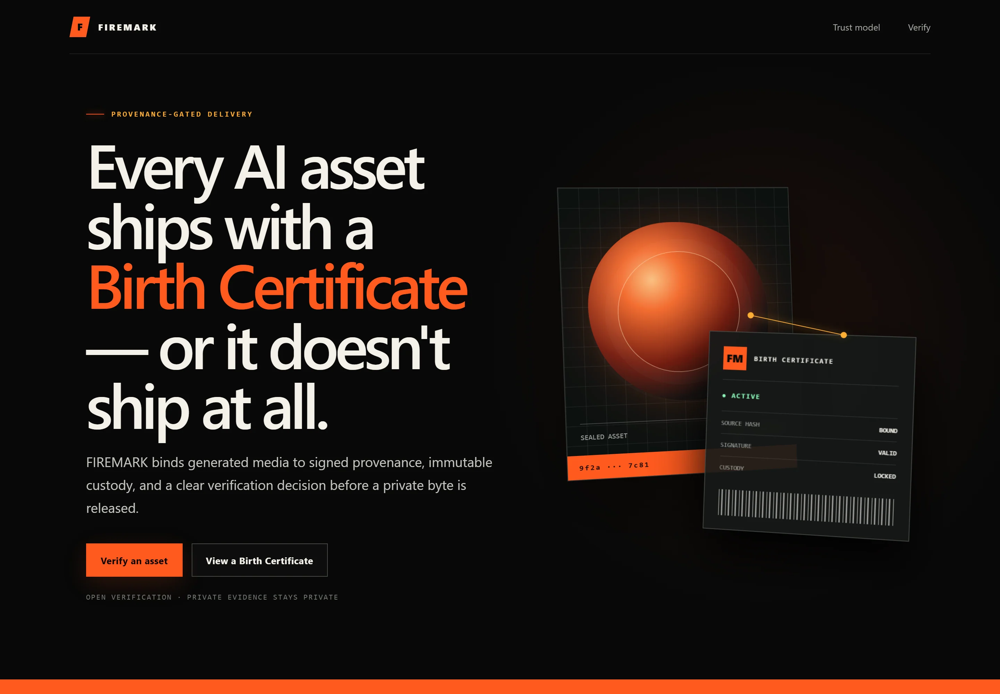
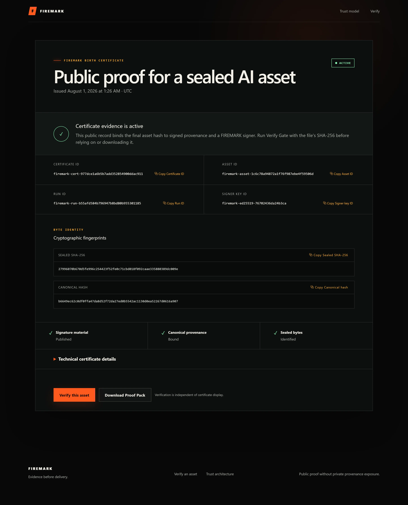
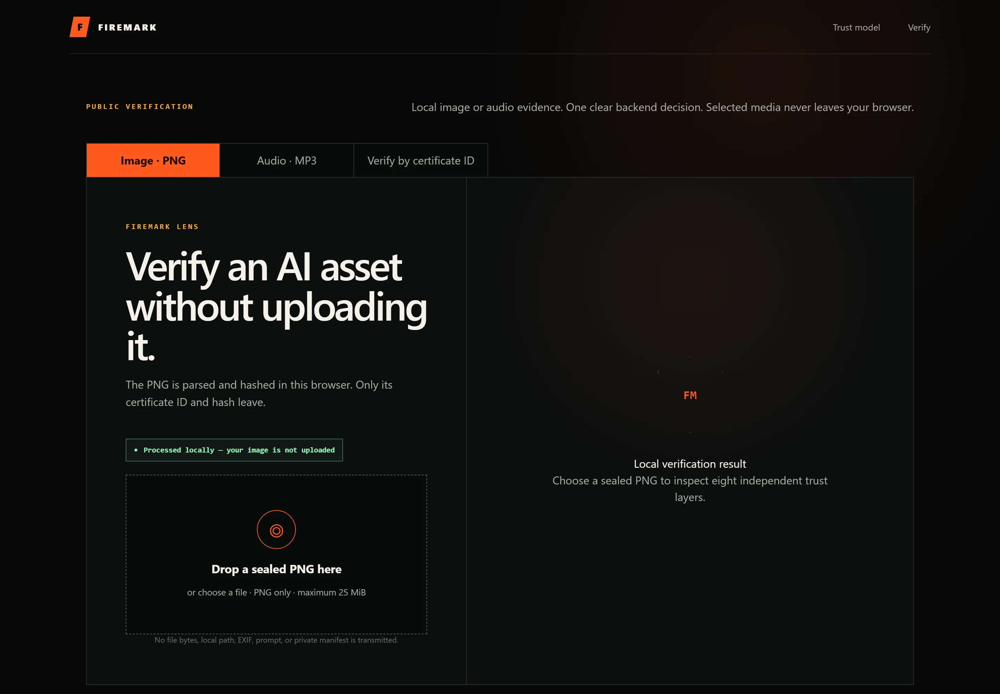
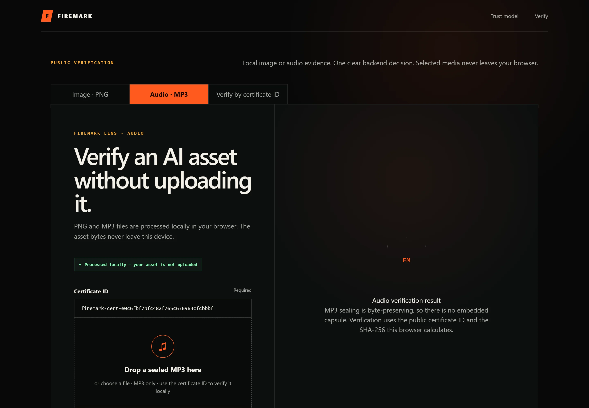

# FIREMARK — 60-second demo

A live walkthrough using real production certificates. No credentials, no setup, no sign-up.

**Live site:** [firemark-web.vercel.app](https://firemark-web.vercel.app)
**API health:** [`/healthz`](https://firemark-api-production.up.railway.app/healthz)

---

## The 60-second script

### 1 · Open the product (5s)

<https://firemark-web.vercel.app>

> *"Every AI asset ships with a Birth Certificate — or it doesn't ship at all."*

The product states its own contract in the hero. Evidence before delivery.



---

### 2 · Open a real Birth Certificate (15s)

**Gemini image** — [`firemark-cert-977dce1a6b5b7add352854900ddac911`](https://firemark-web.vercel.app/certificate/firemark-cert-977dce1a6b5b7add352854900ddac911)

Point at four things:

| Field | Why it matters |
| --- | --- |
| **Certificate ID** | The public handle anyone can resolve. |
| **Sealed SHA-256** | `27996070…89dc009e` — the exact bytes of the distributed file. |
| **Canonical hash** | `b6649ec6…0616a907` — one private provenance record, committed to publicly. |
| **Signer key ID** | Which Ed25519 key sealed this, without exposing the key. |

Everything on this page is public by design. The prompt is not here, and cannot be.



---

### 3 · Compare the audio contract (10s)

**ElevenLabs audio** — [`firemark-cert-e0c6fbf7bfc482f765c636963cfcbbbf`](https://firemark-web.vercel.app/certificate/firemark-cert-e0c6fbf7bfc482f765c636963cfcbbbf)

Same structure — **different hash contract**:

```text
Image   source_sha256  e87ef038…4dc12e2e   ≠   sealed_sha256  27996070…89dc009e
Audio   source_sha256  3863c40f…c870b82a   =   sealed_sha256  3863c40f…c870b82a
```

> The image differs because the PNG carries an embedded public capsule.
> The audio matches because MP3 sealing is byte-preserving — and FIREMARK refuses to fake a capsule
> that isn't there.

This is the line most provenance demos skip. It is the one worth stopping on.

---

### 4 · Verify a file locally (20s)

<https://firemark-web.vercel.app/verify>

FIREMARK Lens is multimodal. Pick the medium, then drop the file.

**Image · PNG** — drop a sealed PNG and watch it resolve **in the browser**:

1. File format parsed locally
2. Embedded capsule extracted from the PNG `tEXt` chunk
3. Full-file SHA-256 computed via Web Crypto
4. Certificate discovered from the capsule
5. Ed25519 signature verified
6. Certificate status checked
7. B2 custody reference confirmed
8. Delivery eligibility resolved



**Audio · MP3** — from the audio certificate, click **Verify this MP3 locally**. The mode is
selected and the certificate ID is prefilled from the URL; nothing is claimed until you choose the
file. There is no embedded capsule, so Lens proves a different chain:

1. Local processing — bytes stayed on this device
2. MP3 format — ID3 tag or MPEG frame sync found in the bytes themselves
3. Public certificate — retrieved by certificate ID
4. Media contract — the certificate really represents `audio/mpeg`
5. Byte-preserving seal — `source_sha256` equals `sealed_sha256`
6. Local file hash — the browser's SHA-256 matches the certificate
7. Cryptographic verification — the public Verify Gate accepted the evidence



Only `{cert_id, presented_sha256}` ever leaves the browser. The file does not.

---

### 5 · Break it on purpose (10s)

Flip a single byte and re-drop the file.

The sealed-hash layer fails, delivery is **blocked**, and the reason is stated plainly. Try a PNG
with no capsule at all: Lens stops locally and never calls the API.

> Failing loudly is the product.

---

## Talking points that land

- **"It verifies bytes, not vibes."** No perceptual matching, no watermark to survive compression.
- **"The database is not the root of trust."** An Ed25519 signature plus immutable B2 custody means
  editing the row changes nothing.
- **"Object Lock COMPLIANCE, proved by read-back."** Enabling Object Lock is not evidence; reading
  retention back from B2 and re-downloading the exact `VersionId` is.
- **"Verification is honest per medium."** Audio has no embedded capsule, so Lens proves the media
  contract and the byte-preserving hash relationship instead of pretending a capsule exists.
- **"One provider call, ever."** Recovery-safe checkpoints mean an interrupted run resumes from
  persisted bytes instead of re-billing a provider.

---

## Fallback flow (offline or no network)

Everything below runs locally with zero network access and no credentials:

```powershell
git clone https://github.com/jpablortiz96/firemark.git
cd firemark
python -m venv .venv
.\.venv\Scripts\Activate.ps1
python -m pip install -e ".[dev]"

python scripts\smoke_trust.py               # Ed25519 sign/verify with ephemeral keys
python scripts\smoke_genblaze_roundtrip.py  # canonical manifest roundtrip + capsule
python -m pytest                            # 882 zero-network tests
```

Then start the stack against the in-memory repository — no Supabase, no B2, no provider:

```powershell
python -m uvicorn api.firemark.app:create_app --factory --host 127.0.0.1 --port 8000
cd web; npm install; npm run dev
```

Open `http://127.0.0.1:8000/docs` for the live OpenAPI surface.

---

## Reproducing the screenshots

Every image on this page is a real capture, never a mock. Production pages come from the live
site; a screen that has shipped in this repository but is not yet deployed is captured from a local
dev server and labelled `"source": "preview"`:

```bash
cd web
npm run capture:readme -- --origin https://firemark-web.vercel.app
```

The script performs public GET navigation only. It sends no bearer token, no provider key and no
signed URL, and records HTTP status, viewport, SHA-256, byte size and the capture source in
[`docs/assets/screenshots/manifest.json`](assets/screenshots/manifest.json).

Screens that are implemented but not yet deployed are captured from a local dev server and marked
`"source": "preview"` in the manifest, rather than published as a production page that lacks the
feature:

```bash
npm run capture:readme -- --origin https://firemark-web.vercel.app --preview-origin http://127.0.0.1:3000
```

---

## Notes for reviewers

- The public certificate and verify endpoints are **anonymous**. You can call them from `curl`.
- Sealing (`POST /v1/generate-and-seal`) is admin-authenticated and is **not** part of this demo —
  it costs provider credits and creates immutable retained storage.
- No step in this walkthrough mutates production state.
